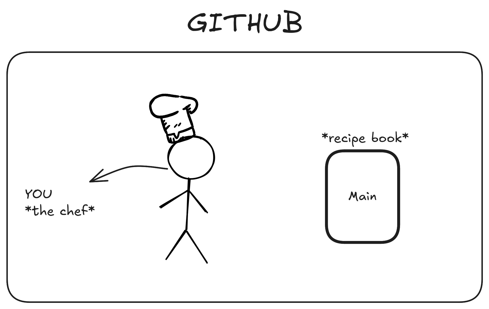
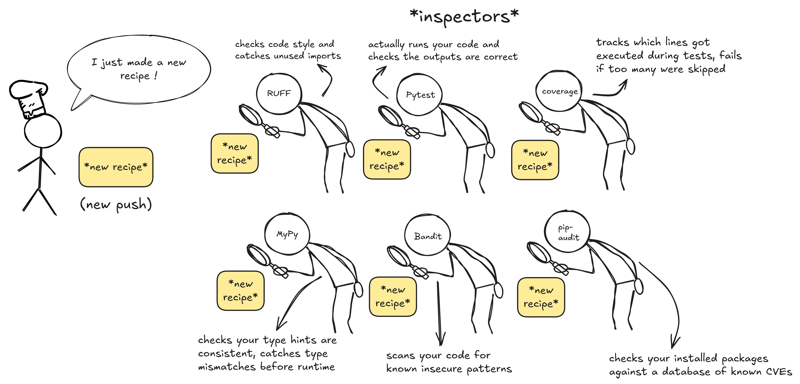
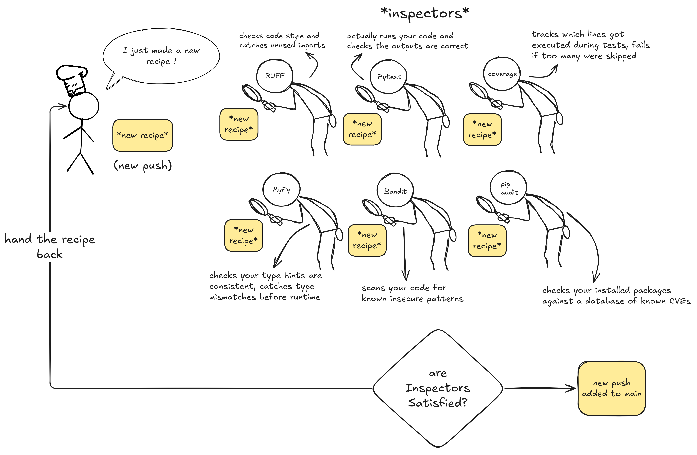
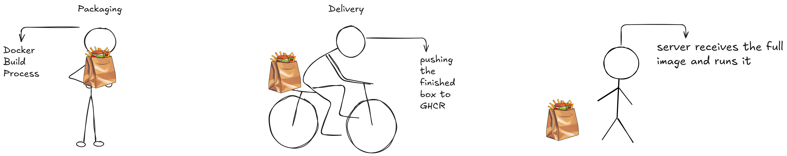
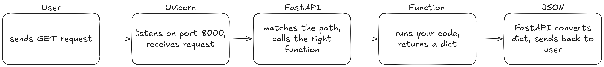

# Visual Walkthrough

Modern software teams don't manually test and ship code. They build a pipeline that does it for them. Every push, automatically. Here's how I did it.

---

**The Workspace**

Everything lives inside GitHub — you (the developer) and the main branch, which is the official stable version of the codebase. Nothing reaches main without going through the pipeline first.

---

**The Inspectors**

Every push triggers 6 checks in parallel. Each one looks at your code from a different angle — style, correctness, coverage, types, security, and dependency vulnerabilities. If any one of them fails, the push gets handed back. Fix it, push again.

---

**Pass or Fail**

If all 6 sign off, the code gets merged into main and semantic-release reads your commit messages to decide the new version number. A `fix:` bumps a patch, a `feat:` bumps a minor, a breaking change bumps a major. That version tag is what kicks off deployment.

---

**Packaging and Delivery**

Docker builds an image — your code, Python runtime, and all dependencies bundled into one sealed artifact. The delivery guy pushes it to GHCR, where every version ever shipped is stored and pullable. The server pulls the image and runs it.

---
(i got tired of drawing)

**Handling a Request**

Once the server is running the image, this is what happens on every single request. Uvicorn sits on port 8000 and receives incoming HTTP requests. FastAPI matches the path and calls the right function. The function runs and returns a Python dict. FastAPI converts it to JSON and sends it back.